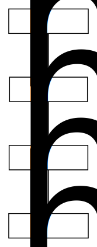
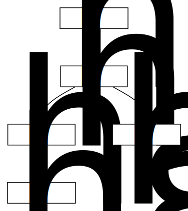
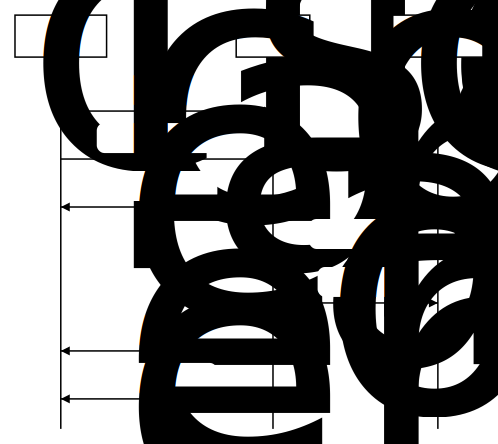

# Vision
## Usage
I want a offline-first database that can be used like this:

```js
const db = new Database()

db.subscribe((new_document) => {
    console.log("document added")
    console.dir(new_document)
})

db.add({
    a: 1234,
    b: "asdf",
})
```

It should sync when a remote is defined:
```js
const db = new Database({ remote: "https://db.seljebu.no" })

db.subscribe((new_document) => {
    console.log("document added remotely or locally")
    console.dir(new_document)
})
```

Querying is done locally on the client, and should not be dependent on the server:
```js
db.find({
    from: ten_days_ago()
}).subscribe((documents) => {
    console.log("documents updated")
    console.dir(documents)
})

function ten_days_ago() {
    return new Date(Date.now() - 10 * 24 * 60 * 60 * 1000)
}
```

## Data structure
To achieve simple syncing, a document will be a node in an [hashed list](https://en.wikipedia.org/wiki/Hash_list). Here is an example of a document:

```json
{
    "id": "aef35758-1407-4ff3-8c99-f5f0c002ae54",
    "prev": null,
    "hash": "d1a26b7582202a5af361853edf0e179480988df8",
    "data": {"a":1234,"b":"asdf"}
}
```

The document document have an identifier `id`, a reference to the previous hash `prev`, a current hash `hash` and some JSON data `data`. The previous hash is `null`, as no previous document exists.

Hash is calculated by taking `sha1(prev + data)`. As `prev` is null for new documents, the hash simplifies to `sha1(data)`.

When the document changes, a new entry is created to reflect the change:

```json
{
    "id": "aef35758-1407-4ff3-8c99-f5f0c002ae54",
    "prev": "d1a26b7582202a5af361853edf0e179480988df8",
    "hash": "8fb455dbf7a1184a50807cc364336a473426adb5",
    "data": {"a":4321,"b":"qwerty"}
}
```

Here `id` is the same, `prev` points to `hash` of the previous entry and `hash` is `sha1('d1a26b7582202a5af361853edf0e179480988df8{"a":4321,"b":"qwerty"}')`.

An illustrated list of entries might look something like this  (for brewety, six hex chars of hash is shown):




## Conflicts
A conflict might look something like this:



The document have one conflict, namely the entries with hash _98d8ca_ and _7a1184_ which both have _8fb455_ as `prev`. This conflict can be detected by searching for entries which have the same identifier `id` and previous hash `prev`.

Conflicts can be presented for the user when detected or resolved by some algorithm.


## Keeping track of synced state
To keep track of what have been synced, an index is added on the server side for every entry. Each time an entry of a document is saved, the index is incremented.

Clients saves the last seen index, such that they can start syncing at the correct place when coming online.



In the illustration above, _client A_ comes online and signals _122_ is the last synced entry. The server starts sending entries to _client A_.

While _client A_ keeps syncing, _client B_ adds a new entry. This entry is queued for syncing to _client A_ which will eventually catch up with all changes.
